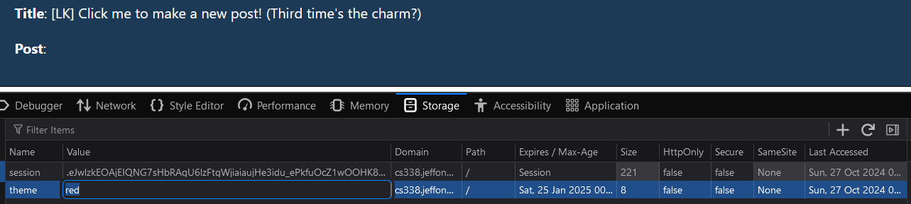
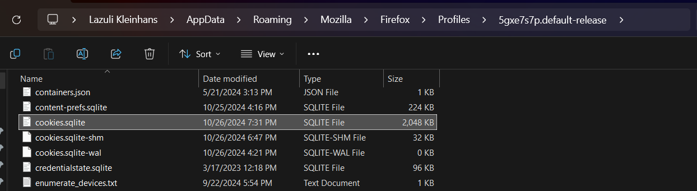

# Part 1: Cookies

## Go to FDF and use your browser's Inspector to take a look at your cookies for cs338.jeffondich.com. Are there cookies for that domain? What are their names and values?
Yes, its name is `theme` and the value is `default`.

## Using the "Theme" menu on the FDF page, change your theme to red or blue. Look at your cookies for cs338.jeffondich.com again. Did they change?
Yes, the value is now the chosen color (`red` or `blue`).

## Do the previous two steps (examining cookies and changing the theme) using Burpsuite. What "Cookie:" and "Set-Cookie:" HTTP headers do you see? Do you see the same cookie values as you did with the Inspector?
I see `Cookie: theme=blue` and `Set-Cookie: theme=blue`. It is the same cookie value.

## Quit your browser, relaunch it, and go back to the FDF. Is your red or blue theme (wherever you last left it) still selected?
Yes it is.

## How is the current theme transmitted between the browser and the FDF server?
The cookie is included in the HTTP request that is sent to the server.

## When you change the theme, how is the change transmitted between the browser and the FDF server?
The new theme is sent to the server through the URL bar:

## How could you use your browser's Inspector to change the FDF theme without using the FDF's Theme menu?
You could manually change the cookie within the browser:

## How could you use Burpsuite's Proxy tool to change the FDF theme without using the FDF's Theme menu?
You could manually change the cookie to say `blue` or `red` instead of `default` in the HTTP request.

## Where does your OS (the OS where you're running your browser and Burpsuite, that is) store cookies? (This will require some internet searching, most likely.)
It stores it in a `.sqlite` file in the browser's folder in AppData:

# Part 2: Cross-Site Scripting (XSS)

## Provide a diagram and/or a step-by-step description of the nature and timing of Moriarty's attack on users of the FDF. Note that some of the relevant actions may happen long before other actions.

1. Moriarty creates a malicious post that runs code.
2. At some later point in time an unsuspecting user opens Moriarty's post, which causes their browser to run the malicious code.
3. This code could do anything from manipulating what the user sees, taking actions on the user's behalf or attempt to steal/phish user's data.
4. As long as this post exists and users open it, the malicious code will continue to get triggered.

## Describe an XSS attack that is more virulent than Moriarty's "turn something red" and "pop up a message" attacks. Think about what kinds of things the Javascript might have access to via Alice's browser when Alice views the attacker's post.

One attack that you could do is redirect the user to a fraudulent login page that looks identical to the site's genuine version. This login page could tell the user they need to login again, and rather than actually logging them in, it just steals the user's username and password.

## Do it again: describe a second attack that is more virulent than Moriarty's, but that's substantially different from your first idea.

Another thing that you could do (and in fact I did) was use session cookies in the browser to send a HTTP POST request and make a new post attributed to the user that opened the post and ran the code.  

## What techniques can the server or the browser use to prevent what Moriarty is doing?

They could sanitize the user input. One method could be not allowing special characters like the `<` or `>`, or adding escape characters that would tell the browser not to take them as literal `< >` characters.